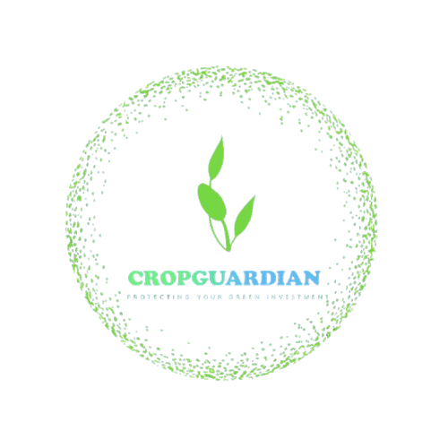

# Crop Disease Prediction and Alert System


<p align="center">
  
</p>

## Table of Contents

* [Introduction](#introduction)
* [System Architecture](#system-architecture)
* [Tech used & Justifications](#technologies--justifications)
* [Core Components](#core-components)
* [Data Processing Pipeline](#data-processing-pipeline)
* [ML Components](#ml-components)
* [Dashboard & Visualization](#dashboard--visualization)
  * [Real-time Data](#real-time-data)
  * [ML Insights](#ml-insights)
  * [Threshold Alerts](#threshold-alerts)
  * [Satellite Map](#satellite-map)
  * [Data Insights](#data-insights)
* [Getting Started](#getting-started)
* [Performance & Results](#performance--results)
* [Limitations & Future Work](#limitations--future-work)
* [Team & Contributors](#team--contributors)
* [Conclusion](#conclusion)
* [References](#references)

## Introduction

The **Crop Disease Prediction and Alert System** is a comprehensive real-time agricultural monitoring platform designed to detect, predict, and alert on potential crop disease outbreaks. The system integrates IoT sensor data, weather information, and satellite imagery to provide early warning capabilities for agricultural stakeholders.

### What Our Project Does

**Environmental Anomaly Detection**
- Continuously monitors environmental parameters (temperature, humidity, soil pH) from simulated IoT sensors, we have used Kaggle datasets to have an idea regarding: variables, mean and standard deviation.
- Integrates real weather data from WeatherAPI.com for environmental correlations
- Identifies anomalous conditions that could favor disease development

**Machine Learning Prediction**
- Utilizes K-means unsupervised clustering for anomaly recognition 
- Classifies risk levels and provides anomaly scores
- Automatic model re-training with new data, which change with seasonality, to improve prediction accuracy continuously.

**Real-Time Processing**
- Processes data through Apache Spark with medallion data lake architecture (Bronze/Silver/Gold)
- Generates immediate alerts when environmental thresholds are exceeded
- Provides real-time notifications through automated alerting system
- Maintains Redis cache for fast visualization data access

**Interactive Dashboard**
- Real-time visualization of sensor and weather data
- Satellite maps for geospatial crop monitoring
- ML insights analysis
- Alert management and monitoring with severity and field filters

## System Architecture 

The system implements a microservices architecture optimized for real-time agricultural data processing. The architecture consists of several integrated layers, each handling specific aspects of the agricultural monitoring workflow:


### Architectural Overview

The system follows a distributed microservices pattern, organized into five primary layers:

1. **Data Acquisition Layer**: Collects IoT sensor data, weather information, and satellite imagery
2. **Stream Processing Layer**: Processes data using Apache Spark
3. **Storage Layer**: Implements a medallion architecture (Bronze/Silver/Gold) 
4. **Analytics Layer**: Implements dual-mode alerting system combining threshold-based detection and ML model for comprehensive anomaly identification and disease risk prediction
5. **Presentation Layer**: Provides dashboards and alerts for agricultural monitoring and decision support

### Component Interaction Flow

The system's architecture facilitates a continuous and robust flow of data from ingestion to visualization.


1.  **Data Ingestion**: The producer services (`sensor-service`, `weather-service`, `satellite-service`) generate simulated or real data and publish it to dedicated Kafka topics.
2.  **Bronze Layer Processing**: The `storage-service` consumes these raw data streams from Kafka. It adds basic metadata and stores the data unmodified in the Bronze zone of the MinIO data lake, ensuring a permanent, raw backup.
3.  **Silver Layer Processing**: The `storage-service` reads the raw data from the Bronze zone, applies validation rules (e.g., range checks, null checks), cleanses it, and standardizes the schema. The resulting cleaned data is stored in the Silver zone as Parquet files. Validated data is also streamed to new Kafka topics (`iot_valid_data`, `weather_valid_data`) for immediate use by downstream services.
4.  **Gold Layer Processing**: The `storage-service` performs advanced aggregations and feature engineering on the Silver data. It uses a 10-minute sliding window to create features optimized for machine learning, storing them in the Gold zone and publishing them to the `gold-ml-features` Kafka topic.
5.  **Dual-Mode Alerting**:
    *   **ML-based Alerts**: The `ml-anomaly-service` consumes features from the `gold-ml-features` topic, uses its K-means model to predict anomalies, and writes the predictions to a PostgreSQL database and a dedicated Kafka topic.
    *   **Threshold-based Alerts**: The `crop-disease-service` consumes validated data streams (`iot_valid_data`, `weather_valid_data`), applies rule-based logic to detect threshold breaches, writes these alerts to PostgreSQL, and publishes them to the `alerts-anomalies` Kafka topic.
6.  **Caching**: The `redis-cache-service` listens to various Kafka topics (validated data, alerts, predictions) and caches the latest information in Redis for fast retrieval.
7.  **Presentation**: The `dashboard` (Streamlit application) queries the `redis-cache-service` and API endpoints on the `crop-disease-service` to present real-time visualizations, alerts, and ML insights to the user. 

## Tech used & Justifications

Our system architecture leverages a modern, scalable tech stack to meet the demands of real-time agricultural data processing.

| Category          | Technology     | Justification                                                                                                                                                             |
| ----------------- | -------------- | ------------------------------------------------------------------------------------------------------------------------------------------------------------------------- |
| **Core Language**   | Python         | Primary language for all microservices.                     |
| **API Framework**   | FastAPI        | A modern, high-performance web framework used to build RESTful APIs in the `crop-disease-service` and `ml-anomaly-service` for serving data and receiving commands.              |
| **Data Streaming**  | Apache Kafka   | Acts as the central nervous system of our architecture, providing a distributed, fault-tolerant message bus for asynchronous communication between microservices.               |
| **Stream Processing**| Apache Spark   | The core processing engine for our data lake. Its Structured Streaming capabilities are used for real-time data validation, transformation, and feature engineering.         |
| **ML Framework**    | PySpark ML     | Used for implementing our K-means clustering model. PySpark ML provides distributed machine learning capabilities that integrate seamlessly with our Spark-based data processing pipeline.                |
| **Containerization**| Docker         | All microservices are containerized with Docker, ensuring consistent, isolated, and reproducible deployments across different environments.                               |
| **Database**       | PostgreSQL     | Serves as the primary relational database for storing structured data like alerts and ML predictions.                             |
| **In-Memory Cache** | Redis          | Provides a high-speed, in-memory caching layer. The `redis-cache-service` uses it to store the latest data points for quick retrieval by the dashboard.                    |
| **Object Storage**  | MinIO          | An S3-compatible object storage solution used to implement our medallion data lake architecture (Bronze, Silver, Gold zones) for storing large volumes of unstructured data. |
| **Dashboard**       | Streamlit      | A Python framework for building interactive web applications. It allows us to rapidly develop and deploy a user-friendly dashboard for data visualization and monitoring.   |

## Core Components

The system comprises multiple specialized microservices organized by function, as visible in the project structure:

```
Crop-Disease-Prediction-and-Alert-System/
├── services/
│   ├── sensor-service/              # Generates simulated IoT sensor data
│   ├── weather-service/             # Retrieves weather data from APIs
│   ├── satellite-service/           # Retrieves satellite data from APIs
│   ├── storage-service/             # 3-zone data lake processing
│   ├── crop-disease-service/        # Real-time alert generation and postgres db inizialization 
│   ├── ml-anomaly-service/          # ML-based anomaly detection
│   ├── redis-cache-service/         # Real-time data caching
│   ├── dashboard/                   # Streamlit visualization interface
│   └── Images/                      # Images used for readme
└── docker-compose.yml               # Container orchestration
```

### Data Producers

* **sensor-service**: Generates simulated IoT sensor data representing agricultural field sensors and publishes to Kafka. We opted for synthetic data generation. 
* **weather-service**: Retrieves real weather data via WeatherAPI.com and publishes weather information to Kafka for environmental monitoring.
* **satellite-service**: Retrieves real Sentinel-2 satellite imagery via the Copernicus API and publishes to Kafka.

### Spark Stream Processing Jobs

* **storage-service**: Implements the complete 3-zone medallion architecture:
  - **Bronze Zone**: Raw data ingestion and storage
  - **Silver Zone**: Data validation, cleaning, and standardization
  - **Gold Zone**: Feature engineering and ML-ready data

* **crop-disease-service**: Performs real-time threshold-based alerting using Spark Structured Streaming:
  - Multi-stage validation of sensor and weather data
  - Rule-based anomaly detection
  - Real-time alert generation using threshold 

* **ml-anomaly-service**: Applies machine learning models for advanced anomaly detection:
  - Trains models on historical data patterns
  - Performs real-time inference on streaming data
  - Generates ML-based predictions and anomaly scores

### Storage Services

* **PostgreSQL**: Primary relational database for storing ML predictions, alerts, and system metadata
* **MinIO**: Object storage with buckets for the medallion architecture (bronze, silver, gold, satellite-images)
* **Redis**: In-memory cache for fast dashboard data access and real-time metrics

## Data Processing Pipeline

The system implements a comprehensive data pipeline that processes agricultural information through multiple stages, demonstrating approaches for reliability, accuracy, and analytical depth in agricultural monitoring.

### Data Acquisition

The system ingests data from three primary sources:

1. **IoT Sensors**: Simulated environmental sensors representing deployments throughout agricultural fields transmit readings every 30 seconds, providing measurements of:
   * Environmental parameters (temperature, humidity, soil pH)
   * Field identification and location data
   * Timestamp 

2. **Weather Data**: Real weather information from WeatherAPI.com, offering:
   * Current weather conditions (temperature, humidity, wind speed, UV index, condition, precipitation)
   * Geographic location data
   * Temporal consistency 

3. **Satellite Imagery**: Real Sentinel‑2 L2A imagery (via Copernicus Data Space), providing:
   * Authentic geographic context from a configurable bounding box (default: Verona)
   * True‑color RGB rendering from bands B04 (Red), B03 (Green), B02 (Blue)
   * Cloud‑coverage filtering (≤10%) to improve scene quality
   * Historical temporal coverage based on available acquisitions; the service simulates minute‑wise ingestion and does not alter satellite revisit frequency

### Real-Time Processing

Data flows through a series of specialized Spark jobs that perform increasingly sophisticated analysis:

1. **Data Standardization**: Raw inputs undergo validation, normalization, and format standardization
2. **Anomaly Detection**: Treshold method identify unusual readings that may indicate disease risk
3. **Location-based Processing**: Field-specific data aggregation and validation
4. **Temporal Aggregation**: Time-window processing (10-minute sliding windows) for feature engineering
5. **Predictive Modeling**: ML models simulate disease risk based on environmental conditions

## Medallion Architecture

The system implements a comprehensive data management strategy using the medallion architecture in MinIO object storage:

### Bronze Layer (Raw Data)
* **Sensor Readings**: JSON-formatted IoT data with temporal partitioning
* **Weather Data**: Raw weather information from external APIs
* **Satellite Metadata**: Image acquisition data and properties
* **Satellite Images**: Raw PNG images stored directly in MinIO `satellite-images` bucket

### Silver Layer (Processed Data)
* **Validated Sensor Data**: Cleaned and validated sensor readings with quality flags in Parquet format
* **Processed Weather Data**: Standardized weather information with validation metrics
* **Satellite Data**: Processed satellite metadata with validation (images remain in `satellite-images` bucket)

### Gold Layer (ML-Ready Data)
* **ML Features**: Aggregated features optimized for machine learning with 10 minutes sliding window processing

### Model Storage
* **ML Models**: K-means clustering models stored in MinIO with versioning and metadata

### Event-Driven Communication

The components communicate through a message-driven architecture built around Apache Kafka:

* **Kafka Topics**: The system uses specialized topics for different data domains:
  - `sensor_data`: Raw sensor data from IoT devices
  - `weather_data`: Weather information from external APIs
  - `satellite_data`: Satellite imagery metadata
  - `iot_valid_data`: Validated sensor data for alerting and dashboard 
  - `weather_valid_data`: Validated weather data for alerting and dashboard 
  - `gold-ml-features`: ML-ready features for anomaly detection
  - `ml-anomalies`: ML-based anomaly detection results (is_anomaly = TRUE)
  - `alerts-anomalies`: Threshold-based alerts published by the crop-disease-service for real-time consumption

## ML Components

The system's predictive capabilities are powered by an unsupervised machine learning model that analyzes environmental data to detect anomalies using PySpark ML.

### Unsupervised Anomaly Detection

* **Model**: K-means Clustering (PySpark ML)
  * **Input Features**: A vector of scaled environmental parameters, including `sensor_avg_temperature`, `sensor_avg_humidity`, `sensor_avg_soil_ph`, `temp_differential`, `humidity_differential`, `sensor_anomaly_rate`, `weather_avg_uv_index`, `weather_avg_wind_speed`, and cyclical temporal features: `temporal_feature_ml_sin`, `temporal_feature_ml_cos`.
  * **Logic**: The model groups historical data into clusters representing "normal" environmental states. New, incoming data points are assigned to the nearest cluster.
  * **Anomaly Score**: The anomaly score is calculated as the Euclidean distance of a new data point from the centroid of its assigned cluster. A larger distance indicates a greater deviation from the norm, signifying a potential anomaly.
  * **Output**: The service generates an anomaly score, a severity level (LOW, MEDIUM, HIGH, CRITICAL) based on pre-defined distance thresholds, and actionable recommendations.

### Feature Engineering

* **Temporal Aggregations**: 10-minute sliding windows for pattern recognition
* **Differential Features**: Temperature and humidity differences between sensor and weather data
* **Cyclical Temporal Features**: Sin/cos transformations of month for seasonal patterns
* **Data Quality Metrics**: Validity rates and freshness indicators

### Model Training and Deployment

* **Initial Training**: The model is automatically trained 4 minutes after the `ml-anomaly-service` starts (demo phase), allowing enough time for initial data to accumulate in the data lake.
* **Scheduled Retraining**: A weekly retraining job (on Sunday) is scheduled to run at 2:00 AM. This ensures the model adapts to evolving environmental patterns and seasonal changes, maintaining its accuracy over time.
* **Data Source for Training**: Training is performed on the aggregated feature data stored in the Gold zone of the MinIO data lake.
* **Model Versioning**: Tracked model versions with metadata and performance metrics

## Dashboard & Visualization

The system provides a comprehensive visualization interface designed for agricultural monitoring and decision support. The dashboard offers specialized views for different aspects of crop disease monitoring.

### Real-time Data

The page provides real-time monitoring of sensor and weather data:

Key features include:
* **Real-time sensor data** visualization with field-specific filtering
* **Weather condition monitoring** with location-based data
* **Environmental parameter** (temperature, humidity, soil pH)
* **Data quality indicators** and validation status


### ML Insights

The ML insights page provides detailed analysis of machine learning predictions:

Features include:
* **Anomaly detection results** with anomaly scores
* **Disease risk predictions** by field and time period
* **Feature importance analysis** for understanding predictions


### Threshold Alerts

The alerts interface enables monitoring and management of environmental alerts:

This view provides:
* **Alert severity filtering** (high, medium)
* **Field-specific alert visualization**
* **Alert information** including thresholds
* **Statistical analysis** of alerts by type and severity


### Satellite Map

The satellite view provides geospatial visualization of agricultural monitoring:

Features include:
* **Field location mapping** with sensor placement
* **Satellite imagery integration** for vegetation health assessment
* **Environmental overlay** showing field data
* **Interactive field selection** for detailed analysis


### Data Insights

The insights page provides comprehensive analytical reporting:

Advanced analytical features include:
* **Alert count** for Ml predictions and treshold alerts
* **Temporal analysis** for Ml predictions and treshold alerts
* **Descriptive statistic** for ML predictions
* **Average risk score distribution** for ML predictions 


## Performance & Results

The Crop Disease Prediction and Alert System demonstrates performance characteristics based on testing with simulated data. These metrics provide insights into how the architecture behaves in agricultural monitoring scenarios.

### System Resource Utilization

The system demonstrates efficient resource management during testing:

* **CPU Utilization**: Processing spikes during intensive operations (Machine learning training and predictions) with efficient returns to baseline


* **Memory Consumption**: Stable memory usage indicating absence of memory leaks


Component telemetry confirms the specialized nature of microservices:
- **storage-service**: Highest memory usage during data lake processing 
- **ml-anomaly-service**: Highest CPU usage due to ML training and real-time inference

### Processing Metrics

Approximate rates with default configuration (1 message/min per producer, 3 fields for sensors):

- **Data Pipeline Throughput**
  - Ingestion (Kafka sources): ~5 msgs/min
    - Sensors: ~3 msgs/min (3 fields × 1/min)
    - Weather: ~1 msg/min
    - Satellite: ~1 msg/min
  - Silver validation → Kafka: ~4 msgs/min
    - `iot_valid_data`: ~3/min
    - `weather_valid_data`: ~1/min
  - Gold feature generation: 3 records every 10 minutes (~0.3 msg/min to `gold-ml-features`)
  - ML anomalies (`ml-anomalies`): depends on data and `ANOMALY_PROBABILITY`
  - Threshold alerts (`alerts-anomalies`): depends on thresholds

- **Message Distribution (ingestion)**
  - Sensors: ~60%
  - Weather: ~20%
  - Satellite: ~20%

Note: rates vary with configuration and data characteristics; values above reflect the demo defaults.

## Limitations & Future Work

### Current Limitations 

Despite its capabilities, the current implementation has several significant limitations:

1. **Synthetic Data**: The system currently uses simulated IoT sensor data instead of real sensor readings. In a production environment, data should come from actual sensors positioned across different agricultural fields to provide authentic environmental measurements.

2. **Basic ML Models**: Currently, for the demo, alerts are forced by setting low thresholds. In production, a much more robust and validated machine learning model would be required to provide accurate disease prediction and risk assessment.

3. **Limited Field Coverage**: The system currently monitors only 3 simulated fields, which is insufficient for large-scale agricultural operations.

4. **Drone Images Integration**: Currently, the system uses satellite images from a free service. It would be beneficial to use paid services that provide high-quality, consistently recent images for better agricultural monitoring and analysis.

5. **External Integration**: The system lacks integration with external notification services. There should be a service that allows farmers to receive messages or phone calls for alerts about anomalies, rather than only visualizing them in the dashboard.

6. **Poor Data Quality and Quantity**: The system lacks specific information about agricultural fields, such as crop types, soil characteristics, historical yield data, and field management practices, etc. With more comprehensive and accurate agricultural knowledge and information, we could create more complex and precise recommendations tailored to specific farming conditions and requirements.

7. **Hardcoded Thresholds**: Currently, the threshold alerts use hardcoded values that are the same for all users and do not account for seasonality. In a production environment, thresholds should be customizable per user and dynamically adjusted based on seasonal variations and specific crop requirements.

### Scaling Challenges

In a real-world deployment, scaling to larger areas or higher data volumes requires improvements across several components:

- **Spark state/shuffle & checkpoints**: Data processing in Silver/Gold layers can consume excessive memory and disk space. To scale properly, optimize executor configurations, implement data flow controls, and store checkpoints on persistent storage (S3/MinIO) rather than temporary local storage.
- **Kafka throughput & reliability**: Demo runs a single broker. To scale, increase topic partitions and replication factor.
- **PostgreSQL storage**: Tables `alerts` and `ml_predictions` will grow quickly. Consider TimescaleDB only if advanced time‑series features are required.
- **Object storage (MinIO/S3)**: Demo uses single‑node MinIO. For production, use distributed MinIO or managed S3 with data lifecycle management and optimized storage strategies for large files.
- **Redis cache**: Single instance. For production, use multiple Redis servers for better performance and reliability, with automatic data backup and recovery. Implement proper TTL (Time To Live) settings to manage data expiration based on data volumes.
- **Dashboard (Streamlit)**: Not designed for high concurrency.
- **Observability & resilience**: Centralize metrics/logs (Datadog), add data quality checks.

### Potential Improvements

Several improvements could address current limitations for a more robust implementation:

* **Real Sensor Integration**: Connect to actual agricultural IoT devices and sensor networks.
* **Advanced ML Models**: Implement deep learning models for more sophisticated disease prediction.
* **Satellite Analytics**: Integrate vegetation health indices and disease-specific spectral analysis, implementing a machine/deep learning model specifically designed for image analysis to detect disease patterns in satellite imagery.
* **Mobile Applications**: Develop mobile apps for field workers and agricultural managers.
* **Predictive Maintenance**: Implement sensor health monitoring and predictive maintenance alerts.
* **Kubernetes Deployment**: In production, the Spark cluster should utilize Kubernetes for better resource management, scalability, and fault tolerance. Kubernetes provides automatic scaling, load balancing, and self-healing capabilities that are essential for handling large-scale agricultural data processing workloads.

## Team & Contributors

This project was developed by:

- [@filippostanghellini](https://github.com/stanghee)
- [@paolofabbri](https://github.com/PaoloFabbri8)
- [@MolteniF](https://github.com/MolteniF)

## Getting Started

### Installation Steps

1. **Clone the repository**:

```bash
git clone https://github.com/stanghee/Crop-Disease-Prediction-and-Alert-System.git

cd Crop-Disease-Prediction-and-Alert-System
```

2. **Configure API credentials**:

Create a `.env` file in the root directory:

```env
## Timezone 
TIMEZONE=Europe/Rome

# Sensor setting
ANOMALY_PROBABILITY=0.5

# Weather API Configuration
WEATHER_API_KEY=your_weather_api_key
DEFAULT_LOCATION=Verona

# Satellite API Configuration
COPERNICUS_CLIENT_ID=your_copernicus_client_id
COPERNICUS_CLIENT_SECRET=your_copernicus_client_secret

# Geographic bounds (default: Verona area)
BBOX_MIN_LON=10.894444
BBOX_MIN_LAT=45.266667
BBOX_MAX_LON=10.909444
BBOX_MAX_LAT=45.281667
```

3. **Start the system**:

```bash
docker-compose up -d
```

4. **Access interfaces**:

* **Dashboard**: http://localhost:8501
* **MinIO Console**: http://localhost:9001 (user/pass: minioadmin)
* **PostgreSQL**: http://localhost:5432 (user: ml_user, pass: ml_password)

### Stopping the System

To stop the system and clean up (rememeber to use -v):

```bash
docker-compose down -v
```

This removes all containers and volumes for a clean restart.

## Conclusion

The Crop Disease Prediction and Alert System represents a comprehensive demonstration of how real-time data processing and machine learning can be applied to agricultural monitoring. While it uses synthetic data and simplified models, the system demonstrates the architecture and approach that could be adopted in a full implementation.

The medallion architecture, real-time processing with Apache Spark, and multi-tier storage approach provide a solid model that could be expanded for real agricultural monitoring applications. The current limitations of the system highlight the areas that would require significant attention for a production deployment.

The system's ability to integrate multiple data sources, perform real-time analysis, and provide actionable insights demonstrates the potential for transforming agricultural management through technology. Future development should focus on real-world validation, advanced ML models, and integration with existing agricultural infrastructure.

## References

- [Medallion Architecture (Databricks Glossary)](https://www.databricks.com/glossary/medallion-architecture)

- [What is the medallion lakehouse architecture? (Databricks Docs)](https://docs.databricks.com/aws/en/lakehouse/medallion)

- [Kmeans Documentation (Apache spark)](https://spark.apache.org/docs/latest/ml-clustering.html)

- [Wolfert, S., Verdouw, C. N., & Bogaardt, M. J. (2017). Big data in smart farming – A review. Agricultural Systems, 153, 69–80.](https://doi.org/10.1016/j.agsy.2017.01.023)

- [Kaloxylos, A., Eigenmann, R., Teye, F., Politopoulou, Z., Wolfert, J., Shrank, C., Dillinger, M., Lampropoulou, I., Antoniou, E., Pesonen, L., Nicole, H., Thomas, F., Alonistioti, N., & Kormentzas, G. (2016). Farm management systems and the future Internet era. Computers and Electronics in Agriculture, 89, 130–144.](https://doi.org/10.1016/j.compag.2012.09.002)

- [Chergui, N., & Kechadi, M. T. (2022). Data analytics for crop management: a big data view. Journal of Big Data, 9(123).](https://doi.org/10.1186/s40537-022-00668-2)