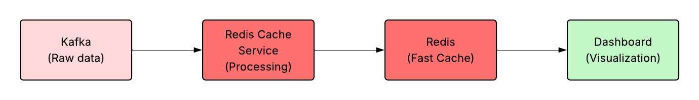

# Redis Cache Service

## Overview

The **Redis Cache Service** is a high-performance real-time data caching and distribution component of the crop disease monitoring system. It acts as an intelligent bridge between streaming data sources (Kafka) and the real-time dashboard, ensuring that all information is consistently up-to-date and instantly accessible with sub-millisecond response times.

The service addresses a fundamental performance challenge: making streaming data fast and reliable for dashboard consumption. Without this service, the dashboard would need to read directly from Kafka or databases, resulting in slow response times and unreliable performance. The Redis Cache Service ensures all data is available in milliseconds with guaranteed consistency through intelligent caching strategies.

### Role in the System



## How It Works

The service operates as a real-time data processing pipeline that continuously collects, validates, transforms, and caches data from multiple Kafka sources. The process ensures data integrity while maximizing performance through intelligent caching strategies and parallel processing.

### Main Data Flow
1. **Collection**: Continuously reads from 4 different Kafka topics (`iot_valid_data`, `weather_valid_data`, `ml-anomalies`, `alerts-anomalies`)
2. **Validation**: Performs integrity checks on each message for completeness and data quality
3. **Processing**: Transforms data into optimized formats for dashboard consumption
4. **Caching**: Stores data in Redis with intelligent TTL (Time To Live) management
5. **Distribution**: Makes processed data available for dashboard

### Processing Architecture
The service uses **4 parallel processing threads** to maximize throughput and ensure fault isolation:

- **SensorProcessor**: Handles IoT sensor data from `iot_valid_data` topic (temperature, humidity, soil pH, coordinates)
- **WeatherProcessor**: Handles meteorological data from `weather_valid_data` topic (temperature, humidity, wind speed, UV index, precipitation, weather conditions)
- **MLAnomalyProcessor**: Manages machine learning anomaly predictions from `ml-anomalies` topic
- **AlertsProcessor**: Manages alert notifications and status updates from `alerts-anomalies` topic

Each thread operates independently, reading from its dedicated Kafka topic and writing to Redis. This architecture ensures that issues in one data stream do not affect the processing of others.

### Data Validation
Each incoming message undergoes comprehensive validation before caching:

- **Required Fields**: Verification that all necessary data fields are present
- **Data Types**: Validation that values match expected data types
- **Range Validation**: Ensures numerical values fall within realistic ranges
- **Schema Compliance**: Checks message structure against predefined schemas

## Data Types Managed

The service manages four distinct data types, each with specific characteristics and optimized caching strategies.

### Sensor Data (IoT Data)
- **Source**: `iot_valid_data` Kafka topic
- **Redis Key Pattern**: `sensors:latest:{field_id}`
- **TTL**: 5 minutes (300 seconds)
- **Data Fields**: Temperature, humidity, soil pH, coordinates, location, timestamp
- **Validation Rules**: Temperature (-20°C to 60°C), Humidity (0-100%), Soil pH (3.0-9.0)
- **Example Key**: `sensors:latest:field_01`

Sensor data has the highest update frequency and shortest TTL due to rapid environmental changes.

### Weather Data
- **Source**: `weather_valid_data` Kafka topic
- **Redis Key Pattern**: `weather:latest:{location}`
- **TTL**: 10 minutes (600 seconds)
- **Data Fields**: Temperature, humidity, wind speed, UV index, precipitation, weather conditions, timestamp
- **Validation Rules**: Temperature (-50°C to 60°C), Wind (0-500 km/h), UV (0-20), Precipitation (0-1000 mm), Humidity (0-100%)
- **Example Key**: `weather:latest:Verona`

Weather data is updated every minute and remains valid for 10 minutes to balance freshness with performance.

### ML Predictions
- **Source**: `ml-anomalies` Kafka topic
- **Redis Key Pattern**: `predictions:latest:{field_id}`
- **TTL**: 1 hour (3600 seconds)
- **Data Fields**: Anomaly score, severity level, recommendations, features used, model version, timestamp
- **Validation Rules**: Anomaly score (0-1), Severity (low/medium/high), Required fields present
- **Example Key**: `predictions:latest:field_01`

ML predictions have longer TTL due to the stability of model outputs and computational cost of regeneration.

### Alerts
- **Source**: `alerts-anomalies` Kafka topic
- **Redis Key Pattern**: `alerts:latest:{zone_id}`
- **TTL**: 30 minutes (1800 seconds)
- **Data Fields**: Alert type, severity, message, timestamp, status, zone information
- **Validation Rules**: Alert type, severity level, message content, status field
- **Example Key**: `alerts:latest:field_01` (sensors) or `alerts:latest:Verona` (weather)

Alerts require extended visibility periods to ensure proper notification and response.

## Technical Specifications

### Performance Configuration
- **Batch Size**: 100 messages per batch (configurable via `PROCESSING_BATCH_SIZE`)
- **Processing Interval**: 1.0 second (configurable via `PROCESSING_INTERVAL`)
- **Connection Pool**: 20 max connections to Redis
- **Consumer Groups**: Separate groups per topic (`redis-cache-group_sensors`, `redis-cache-group_weather`, etc.)
- **Health Check Interval**: 30 seconds
- **Shutdown Timeout**: 30 seconds

### Data Validation Rules
- **Sensor Data**: Temperature (-20°C to 60°C), Humidity (0-100%), Soil pH (3.0-9.0)
- **Weather Data**: Temperature (-50°C to 60°C), Wind (0-500 km/h), UV (0-20), Precipitation (0-1000 mm)
- **Coordinates**: Latitude (-90 to 90), Longitude (-180 to 180)
- **Required Fields**: Each data type has specific required fields that must be present

### Kafka Topics Configuration
```python
KAFKA_TOPICS = {
    "sensor_data": "iot_valid_data",
    "weather_data": "weather_valid_data",  
    "ml_anomalies": "ml-anomalies",
    "alerts_anomalies": "alerts-anomalies" 
}
```

### Redis Key Patterns
```python
REDIS_PREFIXES = {
    "sensors": "sensors",
    "weather": "weather", 
    "alerts": "alerts",
    "predictions": "predictions",
    "system": "system"
}
```

## Output Strategy

The service implements a real-time caching strategy to ensure optimal dashboard performance:

### Redis Storage
- **Purpose**: High-speed data access for dashboard visualization
- **Pattern**: Standardized key patterns for each data type
- **TTL Management**: Automatic expiration based on data freshness requirements
- **Benefits**:
  - Sub-millisecond response times
  - Real-time data availability
  - Automatic data lifecycle management
  - Scalable read operations

### Dashboard Integration
- **Framework**: Streamlit dashboard
- **Data Source**: Direct Redis access using standardized key patterns
- **Real-time Updates**: Dashboard polls Redis every few seconds
- **Features**:
  - Instant data visualization
  - Real-time alert display
  - Performance monitoring

## Code Structure

```
services/redis-cache-service/
├── main.py                           # Service orchestrator and entry point
├── redis_stream_processor.py         # Kafka stream processing with 4 threads
├── redis_client.py                   # Redis operations with connection pooling
├── config.py                         # Configuration management and validation schemas
├── requirements.txt                  # Python dependencies
└── Dockerfile                        # Container configuration with health checks
```
