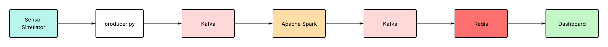

# Sensor Service

This component is an IoT sensor data simulator designed to generate realistic agricultural sensor measurements for multiple fields and stream them to the Kafka messaging system.

## Overview

The Sensor Service operates as a critical data source generating realistic sensor measurements every 60 seconds for multiple agricultural fields. We simulate IoT sensor data through statistical distributions and stream it to the `sensor_data` Kafka topic, which then flows through our Spark processing pipeline to be stored in the MinIO object storage database.

## Components

- **producer.py**: Main sensor simulation and streaming logic
- **entrypoint.sh**: Service startup with Kafka dependency check
- **wait_for_kafka.py**: Ensures Kafka availability before startup

## Key Features

- **Real-time Streaming**: Continuous data generation every 60 seconds
- **Multi-Field Simulation**: Generates data for 3 different agricultural fields (field_01, field_02, field_03)
- **Realistic Data Generation**: Uses statistical distributions (Gaussian, Uniform) for realistic sensor values
- **Configurable Anomalies**: Injects artificial anomalies with configurable probability (default: 50%, for the testing phase)
- **Field-Specific Configurations**: Each field has unique sensor characteristics and baseline values
- **Timezone Awareness**: Proper timestamp handling for accurate temporal analysis

### Data Flow



## Data Schema

The service produces sensor data with the following schema:

```json
{
  "timestamp": "ISO-8601",
  "field_id": "string",
  "location": "string",
  "temperature": "double",
  "latitude": "double",
  "longitude": "double",
  "humidity": "double",
  "soil_ph": "double"
}
```

## Field Configurations

Each agricultural field has specific sensor characteristics:

| Field | Temperature (°C) | Humidity (%) | Soil pH |
|-------|------------------|--------------|---------|
| **field_01** | μ=24, σ=2 | 50-80 | μ=6.5, σ=0.15 |
| **field_02** | μ=28, σ=1.5 | 40-70 | μ=6.8, σ=0.1 |
| **field_03** | μ=22, σ=2.5 | 60-90 | μ=6.3, σ=0.2 |

## Anomaly Generation

The service can inject realistic anomalies to test system resilience:

- **Temperature Anomalies**: ±10°C deviations from normal values
- **Humidity Anomalies**: ±30% deviations 
- **Soil pH Anomalies**: ±2 pH unit deviations
- **Configurable Probability**: Default 50% chance per sensor reading


