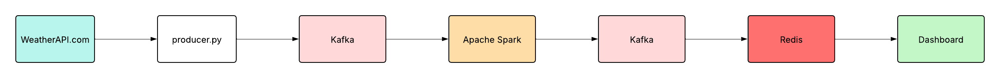

# Weather Service

This component is a real-time weather data producer designed to collect meteorological information from WeatherAPI.com and stream it to the Kafka messaging system.

## Overview

The Weather Service operates as a critical data source collecting real-time meteorological data every 60 seconds from WeatherAPI.com. We fetch weather data through REST API calls and stream it to the `weather_data` Kafka topic, which then flows through our Spark processing pipeline to be stored in the MinIO object storage database. 

## Components

- **producer.py**: Main data collection and streaming logic
- **entrypoint.sh**: Service startup with Kafka dependency check
- **wait_for_kafka.py**: Ensures Kafka availability before startup

## Key Features

- **Real-time Monitoring**: Fetches current weather from WeatherAPI.com every 60 seconds
- **Robust Error Handling**: Comprehensive retry logic and graceful error recovery #TODO: da speiugare meglio non appena avremo la logica implementata
- **Configurable Location**: Environment-based configuration for different agricultural regions
- **Timezone Awareness**: Proper timestamp handling for accurate temporal analysis

### Data Flow



## Data Schema

The service produces weather data with the following schema:

```json
{
  "message_id": "uuid",
  "timestamp": "ISO-8601",
  "location": "string",
  "region": "string", 
  "country": "string",
  "lat": "double",
  "lon": "double",
  "temp_c": "double",
  "humidity": "integer",
  "wind_kph": "double",
  "condition": "string",
  "uv": "double"
}


